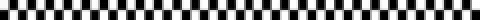

  

  

---

Hi! I'm a Digital Humanities student at the University of Pisa!  
This space showcases the projects I've developed during my academic journey.

### Projects

* **[Computational linguistics](https://github.com/LPugliesi/ProgettoLC)** - Project for the Computational linguistics exam 
* **[Text Encoding](https://github.com/LPugliesi/CodificaRassegnasettimanaleLP)** - Project for the Text Encoding exam 
* **[Databases and Web Lab](https://github.com/LPugliesi/ProgettoBDD-LPW)** - Project for the Databases and Web Laboratory exam 

---

  

  

